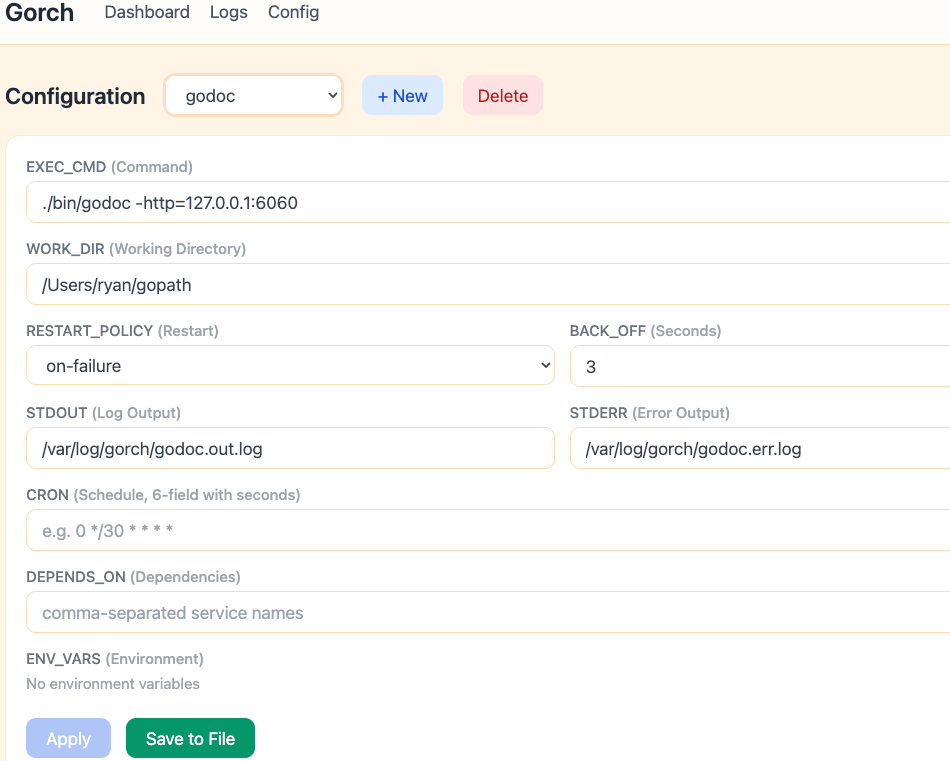

# gorch

轻量级进程管理工具，使用 Go 编写，灵感来自 [Sysg](https://github.com/ra0x3/systemg) 和 [Supervisor](http://supervisord.org/)。

单二进制文件，无运行时依赖。声明式 TOML 配置。内置 Web 管理界面。

[English](./README.md)



## 为什么选择 gorch？

- **双界面管理** — 同时提供 **命令行（CLI）** 和 **Web 界面**，怎么方便怎么来，简单直观。
- **Web 登录支持 TOTP 两阶段认证** — 账号密码直接写在配置文件里，但有了 TOTP 二阶段认证，就算密码泄露了也不怕。
- **单二进制、零依赖** — 一个文件，放哪儿都能跑。
- **优雅重载支持** — 对于 Nginx/Angie 这类守护进程，`RESTART_CMD` 让主进程 PID 保持稳定，只重启 worker。

## 不适用场景

gorch 非常适合 Web 应用、API 服务、定时任务、无状态守护进程。但**不建议**用于：

- **传统大型数据库**（MySQL、PostgreSQL 等）— 频繁重启可能导致数据不一致甚至损坏数据库。请使用数据库自带的管理工具。

## 二进制文件

本仓库构建两个二进制文件：

| 二进制 | 功能 |
|--------|------|
| **gorch** | 进程管理工具 — 管理常驻服务、定时任务，提供 CLI 和 Web 界面 |
| **weblite** | 轻量级静态文件服务器 — 零配置，支持目录列表，直接 serve 一个目录 |

## 安装

### 从源码构建

```sh
export PATH="$GOPATH/bin:$PATH"
go install github.com/azhai/gorch@latest
```

### 安装为系统服务

macOS 下推荐使用 [launchd-ui](https://github.com/azu/launchd-ui) 管理服务。

```sh
gorch install            # 系统级安装（Linux: systemd, macOS: launchd）
gorch install --user     # 用户级安装
gorch uninstall          # 卸载
```

## 快速上手

### 1. 创建配置文件

```sh
cp gorch.toml.example gorch.toml
```

最简配置：

```toml
[services.myapp]
EXEC_CMD = "python app.py"
```

生产环境示例：

```toml
LOG_DIR = '/var/log/gorch'

[web]
WEB_ENABLE = true
WEB_AUTH = true
WEB_USER = "admin"
WEB_PASS = "secret"

[services.api]
EXEC_CMD = "python manage.py runserver 0.0.0.0:8000"
WORK_DIR = "/app/backend"
RESTART_POLICY = "on-failure"
BACK_OFF = 5
CHECK_PORT = 8000
STDOUT = "/var/log/api.stdout.log"
STDERR = "/var/log/api.stderr.log"
DEPENDS_ON = ["redis"]

[services.redis]
EXEC_CMD = "redis-server /etc/redis/redis.conf"
RESTART_POLICY = "always"
BACK_OFF = 3
```

### 2. 启动 gorch

```sh
gorch start                    # 前台运行，默认配置
gorch start -c /etc/gorch.toml # 指定配置文件路径
gorch start -d                 # 以守护进程方式运行
```

### 3. 查看状态

```sh
gorch status
gorch status -s api            # 查看单个服务
gorch status --json            # JSON 格式输出
gorch status -l                # 实时刷新
```

### 4. 控制服务

```sh
gorch restart -s api
gorch stop -s api
gorch stop                     # 停止全部
```

### 5. 查看日志

```sh
gorch logs -s api              # 最近 100 行
gorch logs -s api -n 500      # 最近 500 行
gorch logs -s api -f          # 实时跟踪（tail -f）
```

### 6. Web 管理界面

当 `WEB_ENABLE = true` 时，浏览器打开 `http://127.0.0.1:8080`。

功能：
- 仪表盘：实时状态展示
- 日志查看器：stdout / stderr 切换
- 配置编辑器：两步保存（应用到内存 → 持久化到文件）
- Cron 表达式验证

### 7. 用 weblite 托管静态文件

```sh
weblite -d ./public -p 8000
```

在 8000 端口 serve `./public` 目录，自动生成目录列表。

## 文档

- [配置说明](./docs/configuration-ZH.md) — 所有配置字段、cron 表达式、环境变量、服务配置示例
- [命令参考](./docs/cli-ZH.md) — 所有命令和参数
- [Web 界面](./docs/web-ui-ZH.md) — Web 功能、子目录部署
- [TOTP 两阶段认证](./docs/totp-ZH.md) — 2FA 设置方法、推荐 APP
- [架构设计](./docs/architecture-ZH.md) — 系统设计和技术栈

## 许可证

MIT
